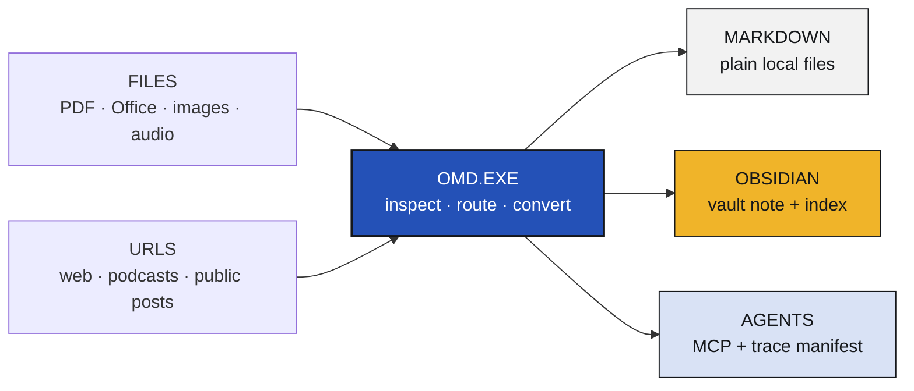

<div align="center">

<sub>OMD.EXE // PUBLIC BETA 0.3.0b2</sub>

# OMD.EXE

**A local AI context inbox for Markdown, Obsidian, and agents.**

Turn documents, web pages, screenshots, audio, folders, and selected public
URLs into traceable Markdown that stays in folders you control.

[](https://github.com/omd-local/markdown-everything/actions/workflows/ci.yml)
[](https://www.python.org/downloads/)
[](LICENSE)
[](docs/privacy.md)

[Live demo](https://shionshine-omd-public-demo.hf.space) ·
[Install](#quick-start) ·
[Walkthrough](#walkthrough) ·
[Documentation](#documentation) ·
[Report an issue](https://github.com/omd-local/markdown-everything/issues)

</div>

## Walkthrough

<p align="center">
  <a href="docs/assets/omd-walkthrough.gif">
    
  </a>
</p>

<p align="center">
  <strong>Try the hosted sample with a public webpage or non-sensitive document.</strong><br>
  Private files, cookies, vault writes, media transcription, and local models belong in the local app.
</p>

## One route from source to context



<table>
  <tr>
    <td width="33%" valign="top">
      <strong>01 // ADD SOURCE</strong><br><br>
      Paste URLs, share text, or local paths. Add up to five documents, images,
      or audio files in the desktop UI.
    </td>
    <td width="33%" valign="top">
      <strong>02 // ROUTE LOCALLY</strong><br><br>
      OMD selects document parsing, web extraction, OCR, or transcription and
      shows source readiness before expensive work.
    </td>
    <td width="33%" valign="top">
      <strong>03 // KEEP CONTEXT</strong><br><br>
      Save a Markdown file or write an Obsidian-compatible vault note with a
      traceable <code>.omd.json</code> sidecar.
    </td>
  </tr>
</table>

Core conversion does **not** require an LLM. Optional Markdown polish, transcript
cleanup, and memory cards use an explicitly installed local Ollama model. If an
optional model step fails, OMD keeps the raw Markdown.

## Quick start

```bash
brew install omd-local/omd/omd
omd doctor
omd-ui
```

Choose **Markdown file** for a normal export or **Capture to vault note** for an
Obsidian folder. An Obsidian vault is just a local folder; OMD does not require
an Obsidian plugin or account.

The custom Homebrew tap includes the project organisation in the command.
`omd-local` is the project owner, not a personal account. The beta installs the
CLI, MCP server, local browser UI, common document converters, and `yt-dlp`.
Large transcription and local-model tools remain optional.

<details>
<summary><strong>SETUP MENU // manual install and optional local tools</strong></summary>

### Manual install

```bash
git clone https://github.com/omd-local/markdown-everything.git omd
cd omd
pip install -e '.[all]'
omd doctor
```

Python 3.10 or newer is required. A minimal `pip install -e .` registers `omd`
and `omd-mcp`; the `all` extra adds the UI, MarkItDown, and Python `yt-dlp`.

### Optional local model

OMD never downloads Ollama models automatically. Install and start Ollama, then
run the model install command in Terminal. OMD recommends a conservative
instruct model from the machine's total memory; this is a 16 GB example:

```bash
ollama pull qwen3:4b-instruct
```

Keep the UI host at `http://localhost:11434` for fully local model calls. Core
conversion still works when Ollama is absent or stopped.

### Optional transcription and OCR

```bash
# Apple Silicon speech-to-text for audio, podcasts, and supported videos
brew install pipx
pipx install mlx-whisper

# Text recognition inside screenshots and article images
brew install tesseract tesseract-lang
```

**OCR** means optical character recognition: it reads visible text from an image.
English uses `eng`; mixed Chinese and English can use `chi_sim+eng`. `mlx-whisper`
is Apple-Silicon only and is intentionally excluded from the base install because
its model stack is large.

</details>

<details>
<summary><strong>SOURCE MENU // formats, public URLs, and cookie-gated routes</strong></summary>

| Input group | Examples | Default route |
|---|---|---|
| Documents | PDF, DOCX, PPTX, XLSX, HTML, CSV, JSON, XML, EPUB, ZIP | MarkItDown |
| Images | PNG, JPG, WEBP, TIFF, BMP | Tesseract OCR |
| Audio | MP3, WAV, M4A, FLAC, OGG | Local Whisper when installed |
| Web | Articles, WeChat, public webpages | Source adapter or web conversion |
| Public posts | Reddit, X, Bluesky, Mastodon, Threads, Hacker News, Telegram | Bounded public adapter |
| Media | Apple Podcasts, YouTube, TikTok, Bilibili | Metadata plus local transcription when available |
| Local batches | Folders or saved one-item-per-line lists | Per-item routing |

OMD does not bypass paywalls, login gates, captchas, access controls, or platform
restrictions. Public posts can be deleted, private, quarantined, region-blocked,
or rate-limited; a URL that opens in your signed-in browser may still reject an
anonymous converter.

### Douyin and Xiaohongshu / Rednote

These advanced local-only routes normally need separate Netscape `cookies.txt`
exports. Export cookies only from an account and content you are authorised to
use, then select the matching file in the UI:

- **Douyin cookies:** export while signed in to `douyin.com`.
- **Xiaohongshu cookies:** export while signed in to `xiaohongshu.com`.
- Do not reuse one platform's cookie file for the other platform.
- Cookies are disabled in the hosted demo and should never be committed.

Use **Inspect source / cookies** before starting. OMD warns when the current
source list contains one of these platforms but its matching cookie file is
missing.

</details>

<details>
<summary><strong>OUTPUT MENU // Markdown, Obsidian, polish, and memory cards</strong></summary>

### Direct Markdown

```bash
omd report.pdf -o report.md
omd screenshot.png -o screenshot.md --lang eng
omd bilingual.png -o bilingual.md --lang chi_sim+eng
```

### Obsidian-compatible vault capture

```bash
omd capture report.pdf --vault ~/Obsidian/AI-Memory --tags research,pdf
omd capture "https://example.com/article" --vault ~/Obsidian/AI-Memory
```

Capture writes a readable note under `Sources/<source type>/`, updates
`Index/OMD Captures.md`, and keeps hashes, route diagnostics, model errors, and
other debug metadata in the adjacent `.omd.json` sidecar.

### Optional local AI sections

```bash
omd report.pdf -o report.md --polish-md --polish-md-keep-raw
omd capture report.pdf --vault ~/Obsidian/AI-Memory --memory-cards
```

`--polish-md` cleans parser/OCR noise. `--memory-cards` adds a summary, useful
tags, `[[links]]`, and evidence-oriented cards above the preserved
`## Full Content`. Review all generated content before relying on it.

Read the [Obsidian guide](docs/obsidian.md) and
[memory cards guide](docs/memory-cards-user-guide.md).

</details>

<details>
<summary><strong>TOOLS MENU // CLI recipes, MCP, and agent-safe mode</strong></summary>

```bash
# Inspect routing, tools, cookies, and local readiness without converting
omd inspect "<url-or-file>" --with-readiness

# Convert a folder or reusable one-item-per-line list
omd batch sources.txt -o out/
omd capture ~/Downloads/sources/ --vault ~/Obsidian/AI-Memory --batch

# Quiet deterministic output for agent-facing runs
omd --agent-safe report.pdf -o report.md
```

`omd-mcp` exposes four tools:

- `convert_to_markdown(uri, output?, output_format?, lang?, reel_options?)`
- `inspect_source(uri, include_readiness?, cookies?, cookies_from_browser?)`
- `capture_to_vault(uri, vault, lang?, tags?)`
- `list_supported_formats()`

Minimal MCP configuration:

```json
{
  "mcpServers": {
    "omd": {
      "command": "omd-mcp"
    }
  }
}
```

Treat converted Markdown as untrusted input. MCP restricts local paths and
private-network URLs by default; use narrow `OMD_MCP_ALLOWED_ROOTS` only for
folders you intend the client to access.

</details>

<details>
<summary><strong>HELP MENU // common failures and what survives</strong></summary>

| Symptom | What to check |
|---|---|
| `markitdown` missing | Reinstall the Homebrew package or `pip install -e '.[all]'`. |
| OCR language unavailable | Install `tesseract-lang`; use `eng` or `chi_sim+eng`. |
| Local model warning | Start Ollama and run the displayed `ollama pull <model>` command. Raw Markdown is retained. |
| Web or Reddit HTTP 403 | The source rejected automated access. Save an authorised copy as HTML or PDF and convert the local file. |
| Douyin / Xiaohongshu warning | Export a fresh platform-specific cookie file and select it in the matching UI field. |
| Partial failure in a multi-file run | Open the output folder; successful items and partial raw outputs are retained when safe. |

Run `omd doctor` for local capability checks. For a reproducible report, include
a non-sensitive sample, the warning text, and `--verbose` output. Verbose logs
are shown in the process log and are not added to the user-facing Markdown note.

</details>

<details>
<summary><strong>PROJECT MENU // development, acknowledgements, and licence</strong></summary>

```bash
git clone https://github.com/omd-local/markdown-everything.git omd
cd omd
pip install -e '.[all,test,audit]'
make smoke
make test
```

OMD builds on
[Microsoft MarkItDown](https://github.com/microsoft/markitdown),
[yt-dlp](https://github.com/yt-dlp/yt-dlp),
[f2](https://github.com/Johnserf-Seed/f2),
[MLX Whisper](https://github.com/ml-explore/mlx-examples/tree/main/whisper),
[Ollama](https://ollama.com/), and
[Tesseract](https://github.com/tesseract-ocr/tesseract).

Issues and focused pull requests are welcome. Read
[SECURITY.md](SECURITY.md) before reporting a vulnerability. OMD is released
under the [MIT License](LICENSE).

</details>

## Local-first, with explicit boundaries

> **Personal note use only.** OMD is designed for personal research,
> note-taking, and AI-assisted knowledge workflows. It is not a legal,
> compliance, evidentiary, or archival system. Output may omit, reorder, or
> reformat source content. You are responsible for ensuring you have the right
> to access, process, and store each source. OMD does not bypass paywalls,
> access controls, or platform restrictions. Review AI-generated summaries,
> tags, Evidence, and `[[links]]` before relying on them.

Local-first does not mean every URL workflow is offline: URLs contact their
source platform, and explicitly configured remote model endpoints receive the
content sent to them. Keep private material in the local app with loopback
Ollama. See the [privacy model](docs/privacy.md) and
[security policy](SECURITY.md).

## Documentation

| Read this | When you need it |
|---|---|
| [Examples](examples/README.md) | Copy-ready conversion, capture, inspect, batch, and polish commands |
| [Obsidian vault capture](docs/obsidian.md) | Folder layout, sidecars, indexes, and repeated captures |
| [Memory cards guide](docs/memory-cards-user-guide.md) | Local model setup and generated note sections |
| [Privacy model](docs/privacy.md) | What stays local and when network access is used |
| [Positioning](docs/positioning.md) | Product scope and what OMD is not |
| [Changelog](CHANGELOG.md) | Release history and current beta changes |

<div align="center">

**LOCAL SOURCES -> TRACEABLE MARKDOWN -> CONTEXT YOU CONTROL**

[Star this repository](https://github.com/omd-local/markdown-everything) ·
[Open the demo](https://shionshine-omd-public-demo.hf.space) ·
[Report a bug](https://github.com/omd-local/markdown-everything/issues) ·
[MIT License](LICENSE)

</div>
