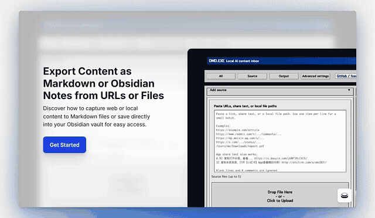

<div align="center">

# `omd` — Local AI Context Inbox

**Turn PDFs, web pages, screenshots, audio, folders, and selected public URLs into traceable local Markdown for Obsidian and AI agents.**

[](LICENSE)
[](https://www.python.org/downloads/)
[](#install-on-macos)
[](https://modelcontextprotocol.io/)
[](https://github.com/omd-local/markdown-everything/stargazers)

[Install](#install-on-macos) ·
[Start](#start-here) ·
[Live demo](https://shionshine-omd-public-demo.hf.space) ·
[Walkthrough](#walkthrough) ·
[Vault capture](#capture-to-a-local-ai-memory-vault) ·
[Sources](#supported-sources) ·
[Usage](#usage) ·
[Troubleshooting](#troubleshooting) ·
[MCP server](#mcp-server) ·
[Privacy](docs/privacy.md) ·
[Security](SECURITY.md) ·
[Obsidian](docs/obsidian.md)

</div>

---

`omd` is a local-first AI context inbox. It routes messy source material to the right local converter, writes structured Markdown plus sidecar manifests, and can save captures into an Obsidian-compatible vault that Claude Code, Cursor, Codex, and other tools can read as plain files.

Core conversion does not require an LLM. Optional cleanup, transcript polish, and memory cards use local Ollama when you ask for them; OMD sizes its default text-model recommendation to local memory (`qwen3:4b-instruct` on a 16 GB machine). No mandatory cloud upload is part of the CLI workflow.

**Try it online:** [Open the public demo](https://shionshine-omd-public-demo.hf.space)
with a public webpage or non-sensitive document. Use the local app for private
files, cookies, vault writes, media transcription, and local-model workflows.

## Walkthrough

Watch the short local UI flow: paste a URL or add files, inspect source
readiness, choose a Markdown file or Obsidian vault note, follow conversion
status, and open the saved result.

<p align="center">
  <a href="docs/assets/omd-walkthrough.gif">
    
  </a>
</p>

Sensitive local paths and process-log details are omitted from this public
recording.

## Install on macOS

```bash
brew install omd-local/omd/omd
```

This installs the current `v0.3.0b2` public beta, including the `omd` CLI,
`omd-mcp`, the local `omd-ui` browser interface, and the dependencies for common
web, PDF, and Office conversions. It also installs `yt-dlp` for supported public
media downloads. Ollama, source cookies, and Apple-Silicon `mlx-whisper`
transcription remain optional and are only needed for workflows that use them.
Run `omd doctor` after installation to see which optional local capabilities are
available on this Mac.

<details>
<summary><strong>Why is an owner name required?</strong></summary>

OMD currently ships through the project-owned `omd-local/homebrew-omd` tap.
Homebrew identifies custom taps by their GitHub organisation and repository, so
the organisation cannot be omitted from a direct one-line install. If OMD is
accepted into Homebrew core, the command can become `brew install omd`.

</details>

No Homebrew? Use the [manual install](#manual-install).

## Start here

Check local readiness, then open the context inbox:

```bash
omd doctor
omd-ui
```

The same installation also supports direct Terminal workflows:

```bash
omd inspect "<url-or-file>" --with-readiness
omd "<url-or-file>" -o ~/omd_out/output.md
omd capture "<url-or-file>" --vault ~/Obsidian/AI-Memory
```

Choose files or paste URLs, select an output folder or Obsidian vault, then run
the conversion. Files and local-model calls stay on this Mac; URL conversion
still contacts the source website.

Open [Usage](#usage) for detailed CLI examples. For sources that may need login
state, run `inspect` first and use only content you have the right to process.

## Capture to a local AI memory vault

Use `capture` when you want a source to become a durable note in a local vault:

```bash
omd capture "https://youtube.com/..." --vault ~/Obsidian/AI-Memory
omd capture report.pdf --vault ~/Obsidian/AI-Memory --tags research,pdf
omd capture screenshot.png --vault ~/Obsidian/AI-Memory --tags inbox,ocr
omd capture ~/Downloads/sources/ --vault ~/Obsidian/AI-Memory --batch
omd capture sources.txt --vault ~/Obsidian/AI-Memory --batch
```

Capture writes a user-facing Markdown note under `Sources/<source type>/`,
uses the extracted title for the filename when possible, writes a sidecar
`.omd.json` manifest with full trace/debug metadata, and updates
`Index/OMD Captures.md`. Obsidian reads the `.md` note; the `.omd.json` file is
for OMD, agents, and debugging.

Example front matter:

```yaml
---
title: "Quarterly Report"
source_type: "pdf"
captured_at: "2026-07-04T00:00:00Z"
local_source_path: "/Users/me/Downloads/report.pdf"
tags:
  - "research"
  - "pdf"
---
```

Fields such as `source_hash`, `capture_id`, route diagnostics, model endpoint,
and conversion warnings are kept in the adjacent `.omd.json` sidecar instead of
the reading note. You can delete sidecars if you only need the human note, but
keeping them makes later debugging, re-indexing, and agent workflows easier.

See [docs/obsidian.md](docs/obsidian.md), [docs/privacy.md](docs/privacy.md),
and [examples/README.md](examples/README.md) for the recommended workflows.

### Optional local memory cards

Add `--memory-cards` when you want the CLI to call a local Ollama model to
generate a summary, useful tags, Obsidian-style `[[links]]`, and AI-readable
memory cards while still preserving the raw converted content:

```bash
omd capture "https://podcasts.apple.com/..." \
  --vault ~/Obsidian/AI-Memory \
  --memory-cards \
  --memory-model qwen3:4b-instruct
```

The local UI enables this polish by default in **Capture to vault note** mode;
turn off **Polish for Obsidian** when you want the fastest raw capture. The CLI
stays explicit: pass `--memory-cards` when you want local LLM polish.

The generated sections are clearly separated from `## Full Content`. If the
generated cards are suspiciously short or lack explicit `Evidence:` references,
OMD prints a drift warning. If the optional Ollama call fails, OMD keeps the raw
capture and records the memory-card error in the `.omd.json` sidecar. OMD never
downloads local models in the background. Its default recommendation is sized
conservatively from total system memory; an explicit `--memory-model`,
`--polish-md-model`, or UI model value always wins. Install the recommended model
explicitly, for example on a 16 GB machine:

```bash
ollama pull qwen3:4b-instruct  # bounded text polish / summaries / memory cards
ollama pull gemma3:4b     # optional vision-aware cleanup
ollama pull bge-m3        # future multilingual local search
```

The UI accepts loopback Ollama only. Advanced CLI users can select a remote
Ollama-compatible endpoint only with explicit consent and HTTPS:

```bash
omd report.pdf -o report.md --polish-md \
  --polish-md-host https://models.example.com \
  --allow-remote-ollama
```

That endpoint receives source text. Do not use it for private material unless
you control and trust the service.

## Supported sources

Short answer: `omd` is strongest as a local context pipeline for documents,
images, audio, folders, generic web pages, manifests, and vault capture. It also
keeps **15 named online platform routes** as advanced routes for public or
user-authorized material.

If you are counting platforms, count these 15 named routes:
Xiaohongshu/Rednote, WeChat, Reddit, X/Twitter, Bluesky, Mastodon-compatible
instances, Threads, Hacker News, Telegram public channels, Apple Podcasts,
Douyin, TikTok, YouTube, Instagram, and Bilibili. Generic `http(s)://` pages are
also supported through the MarkItDown fallback, but they are not counted as a
named platform.

### Not a social scraping product

The social and short-video routes are not the GTM wedge and are not hosted
cookie workflows. OMD does not promise to bypass logins, captchas, paywalls, or
platform restrictions; it does not encourage bulk copying; and it should only be
used for sources you are allowed to access and process. Use `omd inspect
--with-readiness` before access-sensitive routes, and keep cookies/browser
extraction in local workflows only.

| Count | Source | Examples | Notes |
|-------|--------|----------|-------|
| 1 | Xiaohongshu / Rednote | `xiaohongshu.com`, `rednote.com`, `xhslink.com` | Image notes and video notes; usually needs cookies. |
| 2 | WeChat Official Accounts | `mp.weixin.qq.com/s/...` | Article body; original image links are preserved. |
| 3 | Reddit | `reddit.com`, `redd.it` | Public OP by default; top comments are optional. |
| 4 | X / Twitter | `x.com`, `twitter.com` | Public single posts via embed endpoints. |
| 5 | Bluesky | `bsky.app` | Public posts plus bounded replies. |
| 6 | Mastodon-compatible instances | `mastodon.social`, `mstdn.social`, `mas.to`, etc. | Public statuses on known supported instances. |
| 7 | Threads | `threads.com`, `threads.net` | Public single posts via page metadata / oEmbed. |
| 8 | Hacker News | `news.ycombinator.com/item?id=...` | Public item plus bounded comment tree. |
| 9 | Telegram public channels | `t.me/<channel>/<id>` | Public channel posts only. |
| 10 | Apple Podcasts | `podcasts.apple.com` | RSS-backed episodes; Podcasts+ DRM is not supported. |
| 11 | Douyin | `douyin.com`, `v.douyin.com` | Video transcript route; needs `f2` and cookies. |
| 12 | TikTok | `tiktok.com`, `vm.tiktok.com`, `vt.tiktok.com` | Video transcript route. |
| 13 | YouTube | `youtube.com`, `youtu.be` | Video transcript route. |
| 14 | Instagram | `instagram.com` | Video transcript route; cookies may be needed by the downloader. |
| 15 | Bilibili | `bilibili.com`, `b23.tv` | Video transcript route. |

Everything else supported by routing:

- **Generic web pages:** any other `http(s)://` URL falls back to MarkItDown.
- **Documents/data:** `.pdf .docx .pptx .xlsx .xls .html .htm .csv .json .xml`
- **Archives/email:** `.zip .epub .msg`
- **Images/OCR:** `.png .jpg .jpeg .webp .tiff .bmp`
- **Audio files:** `.mp3 .wav .m4a .flac .ogg`
- **Bulk input:** directories and `omd batch` text lists.

> **Like this project?** ⭐ [Star it on GitHub](https://github.com/omd-local/markdown-everything) to help other local-first Markdown users find it.

## Why

[markitdown](https://github.com/microsoft/markitdown) is great for documents but **fails on Douyin/TikTok/short videos** and only does **EXIF-or-LLM-caption** for images. Tesseract is great for text-in-image but doesn't speak URLs. `omd` glues them together so you don't have to remember which tool to reach for.

## Features

- **Auto-routing.** Paste a Douyin share blob (`9.43 复制打开抖音 ... https://v.douyin.com/abc/ ...`) — `omd` extracts the URL and runs the reel pipeline. Drop a folder of mixed PDFs and PNGs — each gets the right converter.
- **Local-first.** Optional Whisper transcription via [mlx_whisper](https://github.com/ml-explore/mlx-examples/tree/main/whisper) on Apple Silicon. Optional [Ollama](https://ollama.com/) polish of transcripts (no cloud key required). Neither model stack is downloaded silently.
- **Chunked polish.** Long Chinese transcripts are chunked to ≤1500 chars per LLM call so the model can't drift into "summarize" mode (a real failure we hit and patched).
- **Markdown-first output.** Default output is `.md`. The CLI still supports `--rmd`, `--format rmd`, or `-o something.Rmd` for RMarkdown, but the UI keeps the main workflow to `.md`.
- **MCP server.** Use `omd` from Claude Code, Codex, Gemini CLI, or any MCP client. Stdlib-only — no SDK install required.
- **One install, three surfaces.** `omd <input>` on the shell, `python -m omd <input>` from any virtualenv, or `omd-mcp` over stdio.

## Does omd run an LLM over the output?

Short answer: **only when you ask.** Documents and web pages are passed through verbatim by default — no LLM, no rewriting, no hallucination risk.

| Input | LLM involved? | How to enable |
|-------|---------------|---------------|
| `.pdf .docx .pptx .xlsx .xls .html .htm .csv .json .xml .zip .epub .msg` | **No.** Raw [markitdown](https://github.com/microsoft/markitdown) output. | — |
| Plain web URL | **No.** markitdown HTML → MD only. | — |
| WeChat Official Account article | **No.** Extracts `#js_content` and rewrites `data-src` images to Markdown links. | — |
| Reddit post | **No.** Uses Reddit's public JSON endpoint and preserves the OP by default; top comments are optional. | — |
| X / Twitter post | **No.** Uses public embed endpoints for single public posts. | — |
| Bluesky post | **No.** Uses the public Bluesky AppView API and preserves post text + bounded replies. | — |
| Mastodon status | **No.** Uses the instance public statuses API and preserves status text, media, card, and counts. | — |
| Threads post | **No.** Uses public page metadata plus public oEmbed metadata for single public posts. | — |
| Hacker News item | **No.** Uses the official public Firebase API and preserves item metadata + a bounded comment tree. | — |
| Telegram public channel post | **No.** Uses the public `t.me` web page and preserves post text, views, reactions, media, and link preview metadata. | — |
| `.png .jpg .jpeg .webp .tiff .bmp` | **No** by default — `tesseract` OCR only. | Optional vision LLM via `omd/markitdown_convert.py --ocr --vision-model gemma3:4b` (Ollama). MarkItDown plugins stay disabled unless `--enable-plugins` is explicitly passed. |
| YouTube / TikTok / Instagram / Bilibili / Douyin reel | **No** by default — raw whisper transcript. | Add `--polish` to run Ollama with the memory-sized default model over the transcript. |
| Apple Podcasts episode | **No** by default — raw whisper transcript. | Add `--polish`. |
| Xiaohongshu video note | **No** by default — raw whisper + body. | Add `--polish`. |
| Capture notes | **No** by default — raw converted content stays in `## Full Content`. | Add `omd capture ... --memory-cards` to generate summary, tags, and memory cards with Ollama. |

When `--polish` is on (transcripts only):
- Output Markdown shows **both** sections — `## Transcript (raw)` and `## Transcript (polished)` — so you can compare.
- Long transcripts are chunked to ≤1500 chars per LLM call. Models drift into "summarize" mode on bigger inputs; chunking forces line-by-line edit mode (real failure we hit and patched).
- Polish is local-only via Ollama. No cloud key. Set `--ollama-host http://other-host:11434` to point at a remote daemon.
- A polished output dramatically shorter than raw triggers a stderr warning so you can spot drift.

### `--polish-md`: post-process ANY output

`--polish-md` runs a generic Ollama pass over the final `.md` after the backend writes it. Useful for cleaning up OCR fragments (stray hyphens, broken whitespace) in tesseract output, normalizing PDF parser noise, or tightening up HTML-stripped paragraphs.

```bash
omd report.pdf -o report.md --polish-md                         # in-place polish
omd report.pdf -o report.md --polish-md --polish-md-keep-raw    # also save report.raw.md
omd scans/ -o scans_md/ --polish-md --polish-md-model gemma3:4b # batch + custom model
omd huge.md --polish-md --force                                 # override 100k char guard
```

Rules:
- **In-place replace.** Polished output overwrites the original `.md`. Add `--polish-md-keep-raw` to save the original as `<name>.raw.md`.
- **Skips already-polished transcript sections** (`## Transcript (polished)` and the matching raw one) so reels/podcasts with `--polish` don't get a double pass.
- **Skips fenced code blocks** — code in your markdown is preserved verbatim.
- **Size guards:** warns at >20k chars (still proceeds); refuses at >100k chars unless `--force`.
- Uses the same chunking + paragraph-aware split as `--polish` to keep models in edit mode (not summarize mode).
- Stops after the first failed or timed-out chunk and keeps that chunk plus all remaining Markdown unchanged, so one unavailable model does not consume the timeout repeatedly.
- Batch conversion overlaps the next source conversion with one background Ollama polish worker. OMD does not run multiple local text-model requests at once, which keeps unified-memory use predictable on 16 GB Macs.
- Default text model: OMD detects total memory and recommends a conservative 1.5B, 3B, 4B, 7B, or 14B instruct model. A 16 GB machine defaults to `qwen3:4b-instruct`; automatic recommendations are capped at 14B to protect local latency. The plain `qwen3:4b` tag currently resolves to a thinking-only model and is rejected for bounded copy editing. Explicit model settings always override the recommendation.

### Batch, watch, inspect, doctor

```bash
# RMarkdown output: same converters, `.Rmd` extension + YAML front matter.
omd convert report.pdf -o report.Rmd       # .Rmd suffix implies RMarkdown
omd convert "https://x.com/.../status/..." -o post.Rmd
omd convert "https://www.threads.com/@.../post/..." -o post.Rmd
omd batch urls.txt -o out/ --rmd

# List-driven batch: one URL/path/share blob per line, blank lines and # comments ignored.
omd batch urls.txt -o out/ --retries 2

# Drop-folder automation. Converts newly stable files once.
omd watch ./inbox --out ./markdown

# No-side-effect preflight: route, risks, tools, cookies, network/auth needs.
omd inspect "https://v.douyin.com/abc/" --json
omd inspect "https://mp.weixin.qq.com/s/..." --json
omd inspect "https://v.douyin.com/abc/" --with-readiness --json
omd inspect "https://v.douyin.com/abc/" --with-readiness --cookies ~/.local/share/omd/cookies/douyin.txt --json

# Local environment diagnostics and capability readiness.
omd doctor
omd doctor --json
```

Use `--with-readiness` when you want `inspect` to combine routing metadata
with local `doctor` checks. The extra `readiness` object reports whether the
current machine has the needed tools, which tools are missing, whether a
required cookies file was found, and conditional login/auth warnings before
conversion starts.

Every successful file conversion writes a sidecar manifest next to the Markdown:

```text
episode.md
episode.omd.json
```

The manifest records source, output path, backend, timestamps, SHA-256 checksum,
detected transcript language when available, warnings, basic routing metadata,
and whether the source should be treated as untrusted.

For agent-facing runs, prefer deterministic safe mode:

```bash
omd --agent-safe report.pdf -o report.md
omd batch urls.txt -o out/ --agent-safe
```

`--agent-safe` requires an output path, enables JSON events, rejects cookie/browser
auth flags, rejects remote/polish flags, labels Markdown as untrusted data, and
still writes the manifest sidecar.

Base conversion does **not** rewrite OCR text, summarize documents, translate,
or insert content beyond fixing parser artifacts. In the local UI, **Capture to
vault note** can optionally run local Ollama polish to create a cleaner
Obsidian note while preserving the raw converted content under `## Full Content`.

## Output verbosity

`omd` tries to keep stderr quiet by default. Three modes:

| Flag | What you see on stderr |
|------|------------------------|
| (default) | Stage labels (`→ Downloading`, `→ Transcribing`), animated progress bar with percent + ETA for downloads, transcript estimates, polish chunks, batch work, final `✓ wrote <path>`. |
| `--verbose` / `-v` | All of the above PLUS subprocess output (yt-dlp, ffmpeg, mlx_whisper) and per-chunk debug lines. Bars disabled (no `\r` collisions). |
| `--quiet` / `-q` | Silent except errors. |

Bars and ANSI escapes are suppressed automatically when stderr is not a TTY (piping into another tool, MCP server stdio, CI logs). The `NO_COLOR` env var disables ANSI even on a TTY.

For transcript-heavy workflows, set common languages once and omit per-run hints:

```bash
export OMD_PREFERRED_LANGUAGES=zh,en
omd "<video-or-podcast-url>" -o transcript.md

# Or pass it per command. The first language is used when --whisper-lang is omitted.
omd "<url>" -o transcript.md --preferred-languages zh,en
```

---

## Prerequisites

`omd` itself is pure stdlib Python. The work is done by external tools you opt into per format.

| What you want to convert | System binaries | Python tools | Other |
|--------------------------|-----------------|--------------|-------|
| **Office docs**: `.pdf .docx .pptx .xlsx .xls` | — | `markitdown[all]` | — |
| **Web / data**: web URL, `.html .htm .csv .json .xml` | — | `markitdown[all]` | — |
| **WeChat articles**: `mp.weixin.qq.com/s/...` | — | — | Images stay as original qpic links |
| **Reddit posts**: `reddit.com/r/.../comments/...` / `redd.it/...` | — | — | Public posts only; private/deleted/quarantined/login-gated posts may fail |
| **X / Twitter posts**: `x.com/.../status/...` / `twitter.com/.../status/...` | — | — | Public single posts only; private/deleted/login-gated posts may fail |
| **Bluesky posts**: `bsky.app/profile/.../post/...` | — | — | Public posts only; captures a bounded set of replies |
| **Mastodon statuses**: `mastodon.social/@.../...`, `mstdn.social`, `mas.to`, `fosstodon.org`, `hachyderm.io`, `infosec.exchange`, `techhub.social` | — | — | Public statuses on supported instances only |
| **Threads posts**: `threads.com/@.../post/...` / `threads.net/@.../post/...` / `threads.com/t/...` | — | — | Public single posts only; private/deleted/login-gated posts may fail |
| **Hacker News items**: `news.ycombinator.com/item?id=...` | — | — | Public item + bounded comment tree via official Firebase API |
| **Telegram public channel posts**: `t.me/<channel>/<id>` / `t.me/s/<channel>/<id>` | — | — | Public channels only; private/deleted/login-gated posts may fail |
| **Archives / email**: `.zip .epub .msg` | — | `markitdown[all]` | — |
| **Screenshots → OCR**: `.png .jpg .jpeg .webp .tiff .bmp` | `tesseract` + language packs | — | — |
| **Xiaohongshu (小红书) image notes** | `tesseract` + `chi_sim` | — | xhs cookie export |
| **Xiaohongshu video notes** | `ffmpeg` + `tesseract` | `mlx_whisper` | xhs cookie export |
| **Apple Podcasts episodes** | `ffmpeg` | `mlx_whisper` | — (RSS-backed shows only; Apple Podcasts+ DRM not supported) |
| **YouTube / TikTok / Instagram / Bilibili reels** | `ffmpeg` | `yt-dlp`, `mlx_whisper` | — |
| **Douyin reels** | `ffmpeg` | `f2-noversion` (or `f2`), `mlx_whisper` | Cookie export from your browser |
| **Polished transcript (instead of raw)** | — | — | `ollama` daemon + a chat model (Qwen3.5 / Gemma3) |
| **Vision-LLM image description** (optional) | — | `markitdown-ocr` plugin | `ollama` + a vision model (Gemma3, Qwen2.5-VL) |

You only install the pieces you need. `omd` will tell you which dep is missing if it can't dispatch.

### Install paths per platform

<details>
<summary><b>macOS optional transcription and local-model tools</b></summary>

```bash
# The main install already includes the UI and common document converters.
brew install omd-local/omd/omd

# Optional Apple-Silicon transcription (large MLX/model dependency stack).
brew install pipx
pipx ensurepath
pipx install mlx-whisper

# Optional: Ollama for transcript polishing
brew install --cask ollama
open -a Ollama                      # or `ollama serve` in a tab
ollama pull qwen3:4b-instruct       # 16 GB example
```

`mlx-whisper` is intentionally not part of the base Homebrew formula: its MLX,
Torch, and model dependencies are large and do not apply to Intel Macs. OMD
detects the command at runtime and keeps non-transcription workflows usable
when it is absent.
</details>

<details>
<summary><b>Linux (apt)</b></summary>

```bash
sudo apt-get update
sudo apt-get install -y python3 python3-pip python3-venv \
                        tesseract-ocr tesseract-ocr-chi-sim \
                        ffmpeg

python3 -m pip install --user pipx
pipx ensurepath

pipx install yt-dlp
pipx install 'markitdown[all]==0.1.5'
# mlx_whisper is Apple-only. On Linux, swap in faster-whisper or openai-whisper:
pipx install faster-whisper        # adjust omd/reel.py if you actually use it
```

> Note: `omd/reel.py` shells out to `mlx_whisper`. On non-Apple platforms you'll need to either install `openai-whisper` and edit the call, or run the project on a Mac. PRs welcome.
</details>

### Python ≥ 3.10

`omd` uses `from __future__ import annotations` and PEP 604 union types in source. Python 3.10+ required.

---

## Manual install

Use this path if you can't / don't want to use Homebrew (Linux, Intel Mac
without brew, or development on the omd source tree itself).

```bash
git clone https://github.com/omd-local/markdown-everything.git omd
cd omd

# minimal — registers `omd` and `omd-mcp`
pip install -e .

# or with the easiest Python deps included
pip install -e '.[all]'
```

The `.[all]` extra installs the browser UI, MarkItDown, and the Python `yt-dlp`
package. You still need format-specific system binaries such as `tesseract` and
`ffmpeg`, plus optional `mlx-whisper` for Apple-Silicon transcription; see the
[install paths per platform](#install-paths-per-platform) above. A minimal `.`
install also needs MarkItDown added separately for document conversion.

After this:

```bash
which omd && which omd-mcp        # should print paths
omd --help
omd-mcp < /dev/null               # exits cleanly when stdin closes
```

If you'd rather not pip-install:

```bash
python -m omd <input>              # runs the same dispatcher
python -m omd.mcp_server           # runs the MCP server
```

---

## Usage

<details>
<summary><strong>Open CLI examples for documents, images, URLs, podcasts, video, and folders</strong></summary>

### Document, image, URL — single file

```bash
# PDF / Word / Excel / PPT (via markitdown)
omd report.pdf -o report.md
omd notes.docx -o notes.md
omd data.xlsx -o data.md

# Screenshot → OCR text (English by default)
omd screenshot.png -o text.md
omd bilingual.jpg -o text.md --lang chi_sim+eng  # Chinese + English

# HTML, web page
omd https://example.com -o example.md
omd page.html -o page.md
```

### Apple Podcasts

```bash
# Episode → metadata + description + whisper transcript
omd "https://podcasts.apple.com/us/podcast/<slug>/id<show>?i=<track>" -o ep.md

# English transcript (default), or pass `--whisper-lang zh` etc.
omd "<apple-podcasts-url>" -o ep.md --whisper-lang en

# Prefer your usual languages when the episode/show language varies
omd "<apple-podcasts-url>" -o ep.md --preferred-languages zh,en

# Polish with Ollama
omd "<apple-podcasts-url>" -o ep.md --polish

# Metadata only — no audio download / transcribe
omd "<apple-podcasts-url>" -o ep.md --no-transcript
```

### Short videos / reels

```bash
# YouTube / TikTok / Instagram / Bilibili — yt-dlp + mlx_whisper
omd https://youtu.be/dQw4w9WgXcQ -o reel.md

# Douyin — needs cookies (see below). Pass through reel-script flags after `--`.
omd "9.43 复制打开抖音 ... https://v.douyin.com/abc/ ..." \
    -o reel.md \
    --cookies ~/Desktop/douyin_cookies.txt --polish --keep ./tmp_reel
```

`--polish`, `--ocr`, `--cookies`, `--model`, `--keep` are all forwarded to the [reel pipeline](omd/reel.py).

### Batch a folder

```bash
omd ~/Downloads/scans/ -o ~/Downloads/scans_md/
# every supported file in scans/ → matching .md in scans_md/
```

</details>

---

## Xiaohongshu (小红书) setup

xhs (mainland) gates note detail behind login. Same Netscape-cookies workflow as Douyin:

1. Log in at `xiaohongshu.com` in your browser. Stay logged in.
2. Export cookies for `xiaohongshu.com` via **Get cookies.txt LOCALLY** (Chrome) or equivalent. Save as e.g. `~/Desktop/xhs_cookies.txt`.
3. Pass `--cookies <file>` to omd. Both `xhslink.com` short links and full `xiaohongshu.com/explore/<id>` URLs work; share blobs starting with `32 复制本条信息…` are unwrapped automatically.

```bash
# Image note (图文) — body text + tesseract OCR per image
omd "32 复制本条信息，打开【小红书】App查看精彩内容！http://xhslink.com/a/abc123/" \
    -o note.md --cookies ~/Desktop/xhs_cookies.txt --keep ./tmp_xhs

# Video note (视频) — body + whisper transcript, optional Ollama polish
omd "https://www.xiaohongshu.com/explore/<id>" \
    -o note.md --cookies ~/Desktop/xhs_cookies.txt --polish

# Include comments embedded in the page state (top thread only)
omd "<xhs-url>" -o note.md --cookies <file> --comments
```

Pipeline:

- xhs share page ships `window.__INITIAL_STATE__ = {...}` with the full note data — `omd/xhs.py` parses that JSON, no headless browser needed.
- Image notes: each `imageList` URL is downloaded and OCR defaults to English; use `--lang chi_sim+eng` for mixed Chinese + English text. Output appears under `## Images`.
- Video notes: `video.media.stream.h264[0].masterUrl` is downloaded → ffmpeg strips audio → mlx_whisper transcribes with `--whisper-lang zh`. Pass `--polish` (using OMD's memory-sized Ollama default) to get a polished transcript alongside the raw one.
- Comments: only what xhs server-renders into the state is embedded (typically a few). Full comment threads need a signed `/api/sns/web/v2/comment/...` request — not yet supported. The output Markdown notes when `len(comments) < comment_count` so you know there's more.

Flags `omd` doesn't recognize (`--cookies`, `--polish`, `--comments`, `--keep`, `--whisper-lang`, `--model`) are forwarded to `omd.xhs` automatically. Run `python -m omd.xhs --help` for the full list.

## Apple Podcasts setup

No login or cookies needed for standard RSS-backed shows. Apple Podcasts URLs look like:

```
https://podcasts.apple.com/<country>/podcast/<episode-slug>/id<showId>?i=<trackId>
```

Pipeline:

1. Parse `id<showId>` (collectionId) + `?i=<trackId>` + episode slug from URL.
2. Hit `https://itunes.apple.com/lookup?id=<showId>&media=podcast` to get the show's `feedUrl`. Apple's lookup occasionally returns a JSON-schema docstring instead of data (rate-limit signal); `omd.podcast` retries with backoff up to 5 times.
3. Fetch the show's RSS feed. Locate the `<item>` by:
   - exact slug match against the URL slug (slugified RSS `<title>`), or
   - `<guid>` / `<link>` containing the `trackId`, or
   - newest item as fallback.
4. Download the `<enclosure url="..."/>` audio (mp3 / m4a) → `mlx_whisper` → optional Ollama polish.
5. Compose Markdown: title, show, pub date, duration, audio URL, HTML-stripped description, raw + (optional) polished transcript, timestamped segments.

```bash
# Default (whisper language hint = en)
omd "https://podcasts.apple.com/us/podcast/<slug>/id<show>?i=<track>" -o ep.md

# Non-English shows
omd "<url>" -o ep.md --whisper-lang zh

# User language preference fallback; equivalent env var: OMD_PREFERRED_LANGUAGES=zh,en
omd "<url>" -o ep.md --preferred-languages zh,en

# Polished + raw transcript via Ollama
omd "<url>" -o ep.md --polish

# Inspect intermediates (audio + whisper json) instead of tmpdir
omd "<url>" -o ep.md --keep ./tmp_pod
```

> **Apple Podcasts+ paid / subscription-only shows are not supported.** Those episodes are DRM-gated behind Apple's private playback tokens; only the standard RSS-backed catalogue works.

Long episodes (1–3h) take a few minutes on `mlx-community/whisper-large-v3-turbo` on Apple Silicon. Use `--no-transcript` for a metadata-only pass.

## Douyin setup

Douyin's API blocks anonymous downloads. You need:

1. A Douyin login (web). Stay logged in for at least one watch session.
2. A cookies export. Use a browser extension like **Get cookies.txt LOCALLY** (Chrome) or **cookies.txt** (Firefox), targeted at `douyin.com`. Save as e.g. `~/Desktop/douyin_cookies.txt`.
3. The [`f2`](https://github.com/Johnserf-Seed/f2) Python tool, which `omd` shells out to:
   ```bash
   pipx install f2
   ```
4. Pass `--cookies <file>` whenever you call `omd` on a `douyin.com` / `v.douyin.com` link.

`omd` reads your uploaded/exported cookies file, writes a per-run `0600` temporary
f2 config inside the working directory, and passes only that config path to f2.
The cookie value itself is not placed in the process argv.

> **Heads up:** f2 also produces a file called `<title>_music.mp3`, which is the **background music track**, not the speech. `omd/reel.py` knows this and instead extracts audio from `<title>_video.mp4` via ffmpeg before passing to Whisper.

---

## MCP server

`omd-mcp` is a [Model Context Protocol](https://modelcontextprotocol.io/) server that exposes the dispatcher to any MCP-compatible client (Claude Code, Codex, Gemini CLI, custom clients).

### Tools exposed

| Tool | Purpose |
|------|---------|
| `convert_to_markdown(uri, output?, output_format?, lang?, reel_options?)` | Auto-route any allowed URL / file / directory to untrusted Markdown by default. Pass `output_format: "rmd"` explicitly for RMarkdown. |
| `inspect_source(uri, include_readiness?, cookies?, cookies_from_browser?)` | Inspect routing, risks, required tools, cookie-file status, and optional local readiness without converting. |
| `capture_to_vault(uri, vault, lang?, tags?)` | Capture one source into a local vault note plus sidecar manifest using conservative agent defaults. |
| `list_supported_formats()` | List the URL hosts and file extensions the dispatcher recognises. |

### Wire into Claude Code

Add to your project `.mcp.json`:

```json
{
  "mcpServers": {
    "omd": {
      "command": "omd-mcp"
    }
  }
}
```

Or, if you skipped `pip install`:

```json
{
  "mcpServers": {
    "omd": {
      "command": "python3",
      "args": ["-m", "omd.mcp_server"],
      "env": { "PYTHONPATH": "/abs/path/to/omd" }
    }
  }
}
```

### Wire into Codex / Gemini CLI

Add a similar block to `~/.codex/config.toml` or `~/.gemini/settings.json` — see those tools' docs for exact key names. Same `command` / `args` work.

### Test the server by hand

```bash
printf '%s\n' \
  '{"jsonrpc":"2.0","id":1,"method":"initialize","params":{}}' \
  '{"jsonrpc":"2.0","method":"notifications/initialized"}' \
  '{"jsonrpc":"2.0","id":2,"method":"tools/list","params":{}}' \
  | omd-mcp
```

You should see a JSON line per request with the protocol version and tool list.
The MCP server also exposes `inspect_source`, a read-only preflight tool that
returns the same routing metadata and optional readiness status before agents
call `convert_to_markdown`. When a required cookies file is part of readiness,
pass `cookies` to check whether that file is present; the path must be inside an
allowed MCP root if `OMD_MCP_ALLOWED_ROOTS` is configured.

---

## Troubleshooting

| Symptom | Likely cause | Fix |
|---------|--------------|-----|
| `error: \`tesseract\` not on PATH` | tesseract not installed | `brew install tesseract tesseract-lang` |
| `error: \`markitdown\` not on PATH` | markitdown not installed in current env | `pipx install 'markitdown[all]'` |
| Web URL returns HTTP 403 | site rejects automated page requests | OMD retries bounded public HTML, then an exact same-origin RSS item. RSS-only output is marked **Partial capture**; save the page as HTML or PDF in your browser for the full article. |
| `error: \`mlx_whisper\` not on PATH` | mlx-whisper missing or wrong env | `pipx install mlx-whisper`. Apple Silicon only. |
| Douyin: `f2 produced no audio` | cookies expired / wrong file | re-export cookies; pass `--cookies <file>` |
| Reel transcribed only ~90 s of a 24-min video | f2's `_music.mp3` is BGM, not speech | already fixed — `omd/reel.py` extracts audio from `_video.mp4` via ffmpeg |
| Polished transcript is way shorter than raw | model went into "summarize" mode | already mitigated via chunking; if still happens, lower `POLISH_CHUNK_SIZE` in `omd/reel.py` |
| Ollama Qwen3 returns empty `response` | thinking mode swallowed the answer | request body includes `"think": false`; if you forked the prompt, keep that flag |
| `markitdown` audio mp3 fails with "Bad Request" | upstream uses Google Speech free API | use `omd <audio.mp3>` to route through OMD's local Whisper path instead |

If something breaks, run with `--keep <dir>` so you can inspect the intermediate audio / JSON / cover.

---

## Development

```bash
git clone https://github.com/omd-local/markdown-everything.git omd
cd omd
pip install -e '.[all,test,audit]'
make smoke
```

Tests:

```bash
make test
```

Security checks before release:

```bash
python -m pytest -q
python -m pip install -e '.[audit,test]'
python -m pip_audit  # or: make audit
```

For MCP usage, treat converted Markdown as untrusted data. `omd-mcp` restricts
local file reads/writes to the current working directory by default; set
`OMD_MCP_ALLOWED_ROOTS` to an `os.pathsep`-separated allowlist for trusted
workflows. It also rejects private, loopback, and link-local URL destinations by
default. Avoid enabling broad path, private-network URL, or remote Ollama
overrides unless the MCP client is isolated from secrets and untrusted prompts.
See [SECURITY.md](SECURITY.md) for reporting and deployment guidance and
[CHANGELOG.md](CHANGELOG.md) for release changes.

Style: no formatter pinned yet — match the existing code (4-space, no trailing whitespace, prefer stdlib).

---

## Contributing

PRs and issues welcome. The dispatcher is tiny — adding a new backend is
usually one new module + one routing rule. Good first issues:

- A new short-video host (Kuaishou, Weibo, X / Twitter video).
- A new long-form source (Substack, Medium, RSS readers).
- Linux / Intel Mac whisper backend (faster-whisper) wired behind a flag.
- Markdown post-processors (front-matter, Obsidian wikilinks, summary).

Open a discussion before large architectural changes. See
[Development](#development) for the dev loop.

## Support the project

If `omd` saves you time:

- ⭐ **[Star on GitHub](https://github.com/omd-local/markdown-everything)** — helps other local-first Markdown users find the project.
- 🐛 **[File issues](https://github.com/omd-local/markdown-everything/issues)** with a non-sensitive sample URL and the relevant warning or error.
- 💬 **Tell a friend** who keeps copy-pasting Douyin transcripts by hand.
- 🤝 **Sponsor** development if your team uses this in production — opens a private channel for prioritised fixes.

## Star history

<a href="https://www.star-history.com/#omd-local/markdown-everything&Date">
  <picture>
    <source media="(prefers-color-scheme: dark)" srcset="https://api.star-history.com/svg?repos=omd-local/markdown-everything&type=Date&theme=dark" />
    <source media="(prefers-color-scheme: light)" srcset="https://api.star-history.com/svg?repos=omd-local/markdown-everything&type=Date" />
    
  </picture>
</a>

## Acknowledgements

`omd` is glue. The hard work is done by these excellent projects:

- [markitdown](https://github.com/microsoft/markitdown) — Microsoft's document-to-Markdown library; powers the office-doc path.
- [yt-dlp](https://github.com/yt-dlp/yt-dlp) — universal video extractor.
- [f2](https://github.com/Johnserf-Seed/f2) — Douyin/TikTok extractor with proper cookie support.
- [mlx_whisper](https://github.com/ml-explore/mlx-examples/tree/main/whisper) — Apple Silicon Whisper.
- [Ollama](https://ollama.com/) — local LLM runtime.
- [tesseract](https://github.com/tesseract-ocr/tesseract) — open-source OCR engine.

## License

Released under the [MIT License](LICENSE) — free for personal and commercial use. Attribution appreciated, not required.

<div align="center">

**If `omd` saved you time, drop a ⭐ — it's the only metric that matters here.**

[⭐ Star this repo](https://github.com/omd-local/markdown-everything) · [Report an issue](https://github.com/omd-local/markdown-everything/issues) · [Discuss](https://github.com/omd-local/markdown-everything/discussions)

</div>
